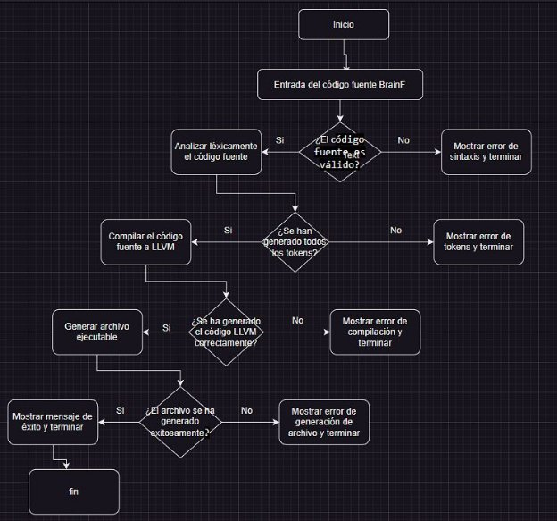

**Universidad Peruana de Ciencias Aplicadas**

**UPC**

# “Año de la unidad, la paz y el desarrollo”

PROYECTO

CURSO DE	Teoría de Compiladores

Carrera de Ciencias de la Computación

Sección: CC61

Alumnos:

Juan Sebastian Osorio Quiroz

Marc Alexander Diaz Quilia

Lima, 28 de junio de 2023

Índice:

1. Introducción 
1. Objetivos
1. Marco Teórico 
1. Diagrama de Flujo
1. Diagrama de Clases
1. Pruebas
1. Conclusiones 

1. Introducción:

En este proyecto, se aborda el desafío de desarrollar un sistema de compilación para el lenguaje BrainF, un lenguaje de programación minimalista y poco convencional. El objetivo principal es diseñar un sistema que pueda analizar el código fuente escrito en BrainF y generar un ejecutable funcional. Para lograrlo, se utilizarán diagramas de clases y de flujo como herramientas de diseño para describir las etapas y los componentes del proceso de compilación. Además, se aprovechará la tecnología LLVM para optimizar y generar código ejecutable eficiente y compatible con diversas plataformas. El proyecto también incluye el desarrollo de un sistema de análisis léxico para identificar errores de sintaxis en el código fuente BrainF.

Con este proyecto, se busca facilitar el desarrollo de programas en BrainF, fomentar la comprensión de lenguajes de programación poco convencionales y explorar las capacidades de los sistemas de compilación. Se espera generar conocimiento práctico en el campo de la traducción de lenguajes de programación y proporcionar una base sólida para futuras investigaciones en este ámbito.

1. Objetivos

- Analizar y comprender la sintaxis y semántica del lenguaje de programación BrainF, así como sus características y limitaciones.
- Diseñar un diagrama de clases que represente las entidades y relaciones necesarias para el proceso de compilación del lenguaje BrainF.
- Desarrollar un diagrama de flujo que describa de manera detallada los pasos a seguir durante el proceso de compilación del código fuente BrainF.
- Implementar un sistema de análisis léxico que sea capaz de reconocer los tokens del código fuente BrainF y generar los correspondientes errores en caso de encontrar sintaxis inválida.
- Desarrollar un compilador que traduzca el código fuente BrainF a código LLVM, aprovechando las capacidades de optimización y generación de código de esta tecnología.

1. Marco Teórico 

El marco teórico de este proyecto se basa en conceptos fundamentales relacionados con los lenguajes de programación, la compilación y la optimización de código. A continuación, se presentan los principales elementos teóricos que sustentan el desarrollo de este proyecto:

- Lenguajes de programación: Se analizan los diferentes tipos de lenguajes de programación, desde lenguajes de alto nivel hasta lenguajes de bajo nivel, y se explora su sintaxis, semántica y características particulares. Se aborda el concepto de gramáticas formales y la importancia del análisis léxico y sintáctico en la interpretación y compilación de los programas.

- Compiladores: Se estudian los fundamentos de los compiladores, que son herramientas encargadas de traducir el código fuente de un lenguaje de programación a un código ejecutable. Se profundiza en las etapas de compilación, como el análisis léxico, sintáctico, semántico y generación de código. Se exploran técnicas de optimización de código, como la eliminación de redundancias y la reorganización de instrucciones.

- Tecnología LLVM: Se introduce el framework LLVM (Low-Level Virtual Machine), que es una infraestructura de compilación de código abierto ampliamente utilizada en la comunidad de desarrollo de compiladores. Se explora su arquitectura, sus componentes clave y sus capacidades de optimización de código. Se analiza cómo se puede aprovechar LLVM para generar código eficiente y compatible con diversas plataformas.

- Lenguaje BrainF: Se describe el lenguaje de programación BrainF, un lenguaje minimalista y esotérico diseñado para desafiar y entretener a los programadores. Se examinan sus características únicas, como su conjunto reducido de instrucciones y su estructura de cinta unidimensional. Se discuten las dificultades asociadas con la interpretación y compilación de programas en BrainF.

1. Diagrama de Flujo:

1. Diagrama de Clases:

1. Pruebas:
- HelloWorld.bf

Este archivo contiene un programa BrainF que imprime "Hello, World!" en la consola.

- Factorial.bf

Este archivo contiene un programa BrainF que calcula el factorial de un número dado por el usuario.

- Fibonacci.bf

Este archivo contiene un programa BrainF que genera y muestra la secuencia de Fibonacci hasta un número específico.

- Loop.bf

Este programa ilustra el uso de bucles en BrainF. Imprime una serie de caracteres en orden ascendente utilizando un bucle y luego en orden descendente utilizando otro bucle.

- Triangle.bf

Este programa dibuja un triángulo utilizando caracteres en la salida. Cada línea del triángulo tiene un número creciente de caracteres.

Enlace al github : <https://github.com/SebastianOsorio20/TF_Compiladores> 

1. Conclusiones:
- El análisis y comprensión de la sintaxis y semántica del lenguaje BrainF proporciona una base sólida para el estudio de los lenguajes de programación y la Teoría de Compiladores. El análisis detallado de sus características y limitaciones permite adquirir habilidades fundamentales para el diseño y desarrollo de compiladores.

- La creación de un diagrama de clases que represente las entidades y relaciones necesarias para el proceso de compilación del lenguaje BrainF es esencial para comprender la estructura y la interacción de los componentes involucrados. Este enfoque proporciona una visión clara del flujo de información y facilita la implementación eficiente del compilador.

- El desarrollo de un diagrama de flujo detallado que describa los pasos a seguir durante el proceso de compilación del código fuente BrainF permite visualizar y comprender el flujo de trabajo completo. Esta representación gráfica es valiosa para identificar posibles cuellos de botella y optimizar el rendimiento del compilador.

- La implementación de un sistema de análisis léxico capaz de reconocer los tokens del código fuente BrainF y generar errores en caso de encontrar sintaxis inválida es esencial para garantizar la correcta interpretación del código. Este proceso ayuda a familiarizarse con los desafíos asociados al análisis léxico y resalta la importancia de la precisión y la detección de errores durante la compilación.

- El desarrollo de un compilador que traduzca el código fuente BrainF a código LLVM, aprovechando las capacidades de optimización y generación de código de esta tecnología, brinda una oportunidad para aplicar conocimientos avanzados de compilación. Este enfoque permite explorar técnicas de optimización y mejora del rendimiento, así como aprovechar las ventajas de la infraestructura existente en LLVM para generar código eficiente y portátil.

- Referencias:

The LLVM Compiler Infrastructure
[**https://llvm.org/**](https://llvm.org/) 

